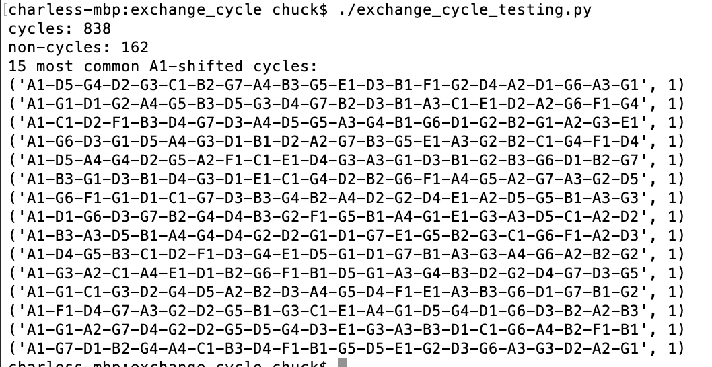

# Exchange Cycle Testing

Testing hamiltonian path and cycle

Looking at output for one hamlitonian path algorithm to see if we want to use it.

The paths are generated, tested to determine if they are cycles, and if so, shifted/rolled so that A1 is at the head.

### Example output

